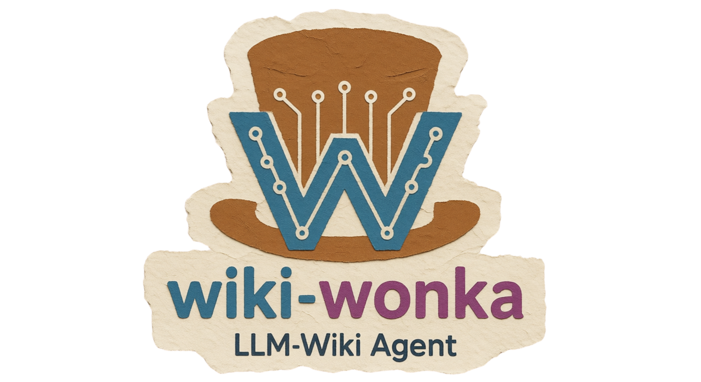

<p align="center">
  
</p>

# wiki-wonka
LLM Wiki
**A persistent, LLM-maintained knowledge base inspired by [Karpathy's LLM Wiki pattern](https://gist.github.com/karpathy/442a6bf555914893e9891c11519de94f).**

## 🧭 Overview

wiki-wonka is an agent-driven system for building and maintaining a structured, evolving wiki of knowledge. Instead of relying on stateless retrieval (RAG) for every query, wiki-wonka compiles and curates knowledge into a persistent, interlinked set of Markdown pages. The LLM agent handles all the summarizing, cross-referencing, and bookkeeping—so your knowledge base compounds and improves over time.

## 🛠️ How it works

- **Raw sources**: Immutable documents (papers, articles, data) are added to the `raw/` folder. The LLM never edits these files.
- **Wiki**: The agent generates and maintains Markdown pages in `wiki/`, including summaries, entity pages, concepts, and an evolving synthesis. All cross-references and updates are handled automatically.
- **Schema**: The structure and conventions are defined in a schema file (see `wiki/SCHEMA.md`). This ensures consistency and enables the LLM to act as a disciplined maintainer, not just a chatbot.

## ⚡ Main operations

- **Ingest**: Add a new source to `raw/` and instruct the agent to process it. The agent reads, summarizes, updates relevant pages, and logs the operation.
- **Query**: Ask questions against the wiki. The agent synthesizes answers from existing pages, always citing sources. New insights can be filed back into the wiki.
- **Lint**: Periodically check the wiki for contradictions, stale claims, orphan pages, and missing cross-references. The agent suggests fixes and keeps the knowledge base healthy.

## 🌐 Language support

wiki-wonka generates all wiki content in the language configured in `wiki/config.md`:

```yaml
---
language: pt-BR   # e.g. en-US, pt-BR, es
---
```

The orchestrator reads this file at startup and enforces the language across every operation — ingest summaries, query answers, concept definitions, lint reports, and free-conversation responses. To switch languages, edit the file and continue working; existing pages are not rewritten automatically.

What always stays in English regardless of the setting:
- Frontmatter field names (`title`, `slug`, `type`, `tags`, …)
- File slugs (`attention-mechanism.md`)
- Callout types (`[!contradiction]`, `[!gap]`, `[!outdated]`, `[!deprecated]`)

## 🗂️ Indexing and logging

- `wiki/index.md`: Catalog of all wiki pages, organized by category, with summaries and links.
- `wiki/log.md`: Chronological log of all ingests, queries, and maintenance actions.

## 🤔 Why this approach?

Traditional RAG systems force the LLM to rediscover knowledge from scratch on every query. By maintaining a persistent, evolving wiki, wiki-wonka enables deeper synthesis, better cross-referencing, and a continuously improving knowledge base. The LLM does the grunt work; you curate sources and guide the process.


## 💡 Usage

Before interacting, start the agent server in claude code:

```bash
# 1. navigate to the project root
cd wiki-wonka

# 2. start the agent server with the current directory as the plugin source
claude --plugin-dir .
```
>[!NOTE]
> You can then interact with the agent `wiki-wonka` through any interface that supports the plugin, such as a chat UI or Copilot.

The user interacts directly in natural language—no special commands to memorize. The orchestrator interprets intent and routes to the right skill.

Here are the main interaction patterns:

---


### Ingest

The user mentions a source—file path, pasted URL, or direct content:

```
"process this article: raw/attention-is-all-you-need.md"

"I just saved a PDF in raw/, it's called transformers-survey.pdf"
```

The agent confirms, executes the ingest, and reports how many pages were touched:

```
Ingesting "Attention Is All You Need"...

Created: sources/attention-is-all-you-need
Updated: entities/vaswani-ashish, concepts/self-attention,
		 concepts/transformer, overview
Log updated. 4 pages touched.

Would you like to discuss any point before continuing?
```

---

### Query

The user asks questions as they would to a domain expert:

```
"what's the difference between self-attention and cross-attention?"

"what do my sources say about transformer scalability?"

"is there any contradiction between Vaswani's paper and the survey?"
```

The agent reads relevant pages from `wiki/` before answering—never from memory—and cites sources. At the end, it offers to archive:

```
[answer with citations from wiki/concepts/self-attention and wiki/sources/...]

Would you like me to archive this analysis as a new concept page?
```

---


### Lint

The user asks explicitly or the agent may suggest periodically:

```
"run a lint on the wiki"
"are there any orphan pages?"
"what is outdated after the last ingest?"
```

The agent returns a structured report and asks what to fix:

```
Lint complete. Found:
- 2 contradictions (concepts/attention vs concepts/self-attention)
- 1 orphan page (entities/lecun-yann — no inbound links)
- 3 concepts mentioned without their own page

Would you like me to resolve everything now or review item by item?
```

---


### Free conversation

The user can also just chat—the orchestrator decides if a skill is needed or responds directly:

```
"what do I already have in the wiki about LLMs?"
→ orchestrator reads index.md and responds without invoking a skill

"what were the last 3 ingests?"
→ orchestrator reads log.md and responds

"what should I ingest next about attention?"
→ orchestrator synthesizes wiki gaps and suggests sources
```

---


### For Copilot specifically

In VS Code with Copilot, the user opens the chat panel and uses `@workspace` to give repository context. Interactions are the same, but Copilot is more helpful when the user mentions files explicitly:

```
@workspace process the file raw/my-paper.md as a wiki ingest
```

Compatibility works because `.github/copilot-instructions.md` contains the same routing rules as `CLAUDE.md`—the user doesn't need to change vocabulary between the two agents.


## 🛠️ Troubleshooting

### Problem: hook scripts lack execution permission

If you get an error about permission denied when running any hook-related command, it means the scripts do not have execution permission.

To fix this, run:

```bash
chmod +x hooks/*.sh
```

Then reload the hooks:

```bash
/reload-plugins
```

To confirm it worked before reloading:

```bash
ls -la hooks/*.sh
```

The output should show `-rwxr-xr-x` at the start of each line. If it still shows `-rw-r--r--`, the `chmod` was not applied in the correct folder—make sure you are in the project root (`wiki-wonka/`) before running the command.


## 📚 References


- Read the original pattern: [Karpathy's LLM Wiki gist](https://gist.github.com/karpathy/442a6bf555914893e9891c11519de94f)
- See the schema and skills in the `wiki/` and `skills/` folders

---

*Inspired by the ideas and community around LLM-powered knowledge management. See the gist for more discussion, extensions, and related projects.*
